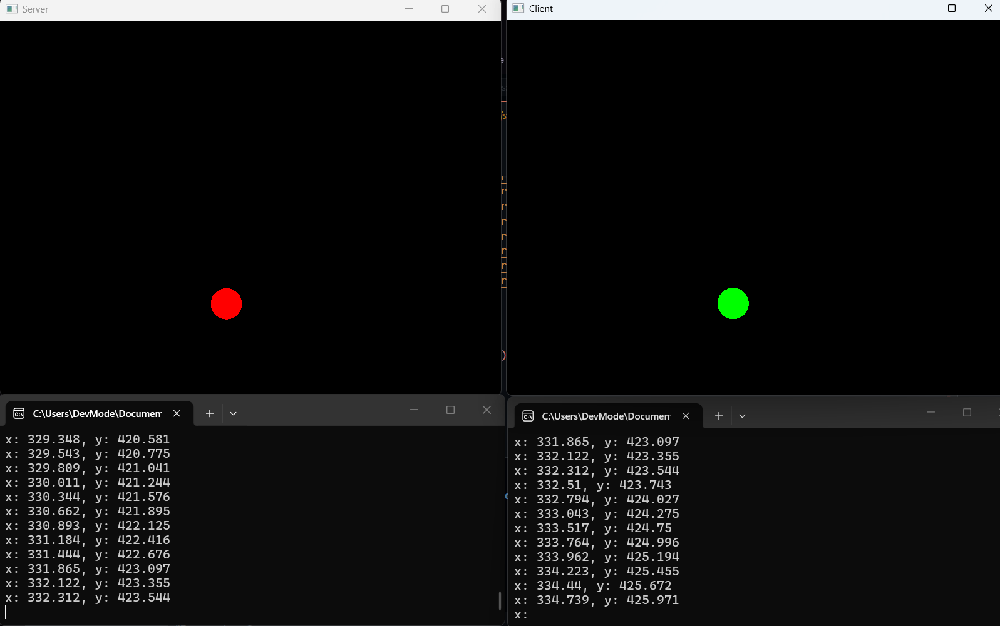

# BallGreview

Small C++ client/server project using **SFML** and **WinSock** to synchronize the position of a ball between a client application and a server application.

## Overview

- **Client**: displays a green ball and continuously sends its position to the server via UDP.
- **Server**: receives the position sent by the client and displays a synchronized red ball.
- **Communication**: local UDP socket on port `9999`.



[Watch demo video](assets/video_preview.mp4)

## Features

- Graphics rendering with SFML
- Network communication using UDP (WinSock)
- Two separate executables: `Client` and `Server`
- Solution generation helper `SolutionGen.exe`

## Prerequisites

- Windows
- Visual Studio with C++ development workload
- SFML 3 (installed via vcpkg or manually)
- vcpkg configured to install dependencies

## Project structure

- `src/Client`: client application source code
- `src/Server`: server application source code
- `config/settings.json`: project and solution configuration
- `bin/`: build and clean helper scripts
- `ide/`: Visual Studio solution and project files

## Installation

1. Clone the repository.
2. Install dependencies (for example using vcpkg).
3. Generate/build the solution using the helper scripts in `bin/`.

Examples (PowerShell):

```powershell
bin\make.bat
```

To build a single project:

```powershell
bin\make-client.bat
bin\make-server.bat
```

## Running

1. Start the `Server` executable first.
2. Then start the `Client` executable.
3. The client will continuously send the ball position to the server.

## Network port

- Address: `127.0.0.1`
- UDP port: `9999`

## Technical notes

- The client uses `sf::Clock` to animate the ball movement.
- The server listens in a dedicated loop/thread and updates a shared position used for rendering.
- This project is intended as a demonstration and learning base.

## Possible improvements

- Support multiple clients
- Use a more robust message serialization format (e.g. JSON, protobuf)
- Synchronize velocity and direction in addition to position
- Add runtime configuration for port and address

## License

No license is set yet. Add a LICENSE file before publishing the repository publicly.
